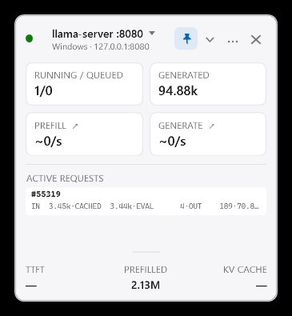

# LLM Meter

LLM Meter is a lightweight Windows tray widget for watching local LLM inference servers in real time. It discovers local and WSL backends automatically and presents throughput, queue activity, token totals, cache reuse, and active requests without sending telemetry off the machine.



## Highlights

- Live prefill and generation throughput with five-minute activity charts.
- Running and queued request counts.
- Stable active-request rows showing input, cached, evaluated, and output tokens.
- Automatic discovery across Windows listeners, known localhost ports, and WSL.
- Multiple independent widgets with saved position, scale, expansion, and topmost state.
- Light and dark themes with per-monitor DPI support.
- Honest metric provenance: native, derived, or unavailable—never fabricated.
- Fully local operation with no analytics or cloud dependency.

## Supported backends

| Backend | Detection | Telemetry source |
| --- | --- | --- |
| llama.cpp / llama-server | `/metrics` with `llamacpp:*` or `/slots` | Prometheus metrics, `/slots`, and `/props` |
| vLLM | `/metrics` with `vllm:*` | Prometheus counters, gauges, and histograms |
| LM Studio | `/api/v0/models` | Native REST API with v1 fallback |
| Ollama | `/api/version`, `/api/ps`, `/api/tags` | Native REST API |
| Generic OpenAI-compatible | `/v1/models` response shape | Connectivity and model information only |

For full llama-server telemetry, start it with `--metrics`. The `/slots` endpoint supplies active-request details and is enabled by default in current llama.cpp releases.

## Install

Download `LLMMeter.exe` from the [latest GitHub release](https://github.com/Jiefei-Wang/llm_monitor/releases/latest) and run it. The executable is self-contained; a separate .NET installation is not required.

LLM Meter places its configuration beside the executable in `LLMMeter.json`. Corrupt configuration is backed up with a `.broken` suffix and replaced safely.

## Usage

- Drag the widget to move it.
- Use `Ctrl` + mouse wheel or the scale menu to resize it.
- Expand the widget to inspect active requests and additional telemetry.
- Click a throughput card to switch between its current value and five-minute chart.
- Use the header or tray menu to add endpoints, switch themes, toggle topmost, or open another widget.

The active llama-server request card puts generation speed beside the task ID and uses compact, fixed-width token fields:

```text
#15720  61.4/s
IN 12.32k · CACHED 512    · EVAL 11.81k · OUT 203
```

`IN` is the total prompt represented by cached plus newly evaluated tokens. `CACHED` is reused KV-cache content, `EVAL` is prompt work performed for the request, and `OUT` is generated output.
The speed beside the task ID shows prompt-evaluation throughput during prefill and automatically switches to decode throughput when output generation begins.

## Metric integrity

Every displayed value retains its source and quality:

- **Exact** values come directly from a backend endpoint.
- **Approximate** values are defensible derivations such as counter deltas, EMA-smoothed rates, or histogram changes.
- **Unavailable** values are displayed as an em dash instead of being guessed or replaced with zero.

Rates use a monotonic clock, handle counter resets, and do not report negative throughput. One collector is shared by all widgets monitoring the same endpoint.

## Build and test

Requirements: Windows and the .NET 8 SDK.

```powershell
dotnet test tests\LLMMeter.Tests\LLMMeter.Tests.csproj
dotnet publish src\LLMMeter\LLMMeter.csproj `
  -c Release -r win-x64 --self-contained true `
  -p:PublishSingleFile=true -o publish
```

The release artifact is `publish\LLMMeter.exe`.

## Automated releases

Pushing a version tag such as `v1.0.0` runs the GitHub Actions release workflow. It tests the project on Windows, builds the self-contained single-file executable, and creates a GitHub release with generated release notes and `LLMMeter.exe` attached.

```powershell
git tag -a v1.0.0 -m "LLM Meter v1.0.0"
git push origin v1.0.0
```

## Privacy

LLM Meter only makes read-only requests to local endpoints that it discovers or that you configure. It does not store prompt or completion text, upload metrics, or contact an external analytics service.
